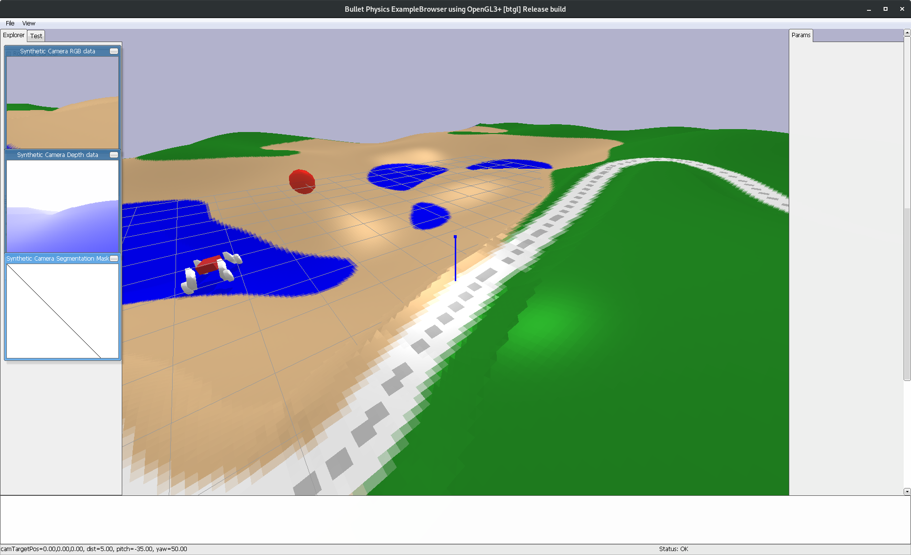
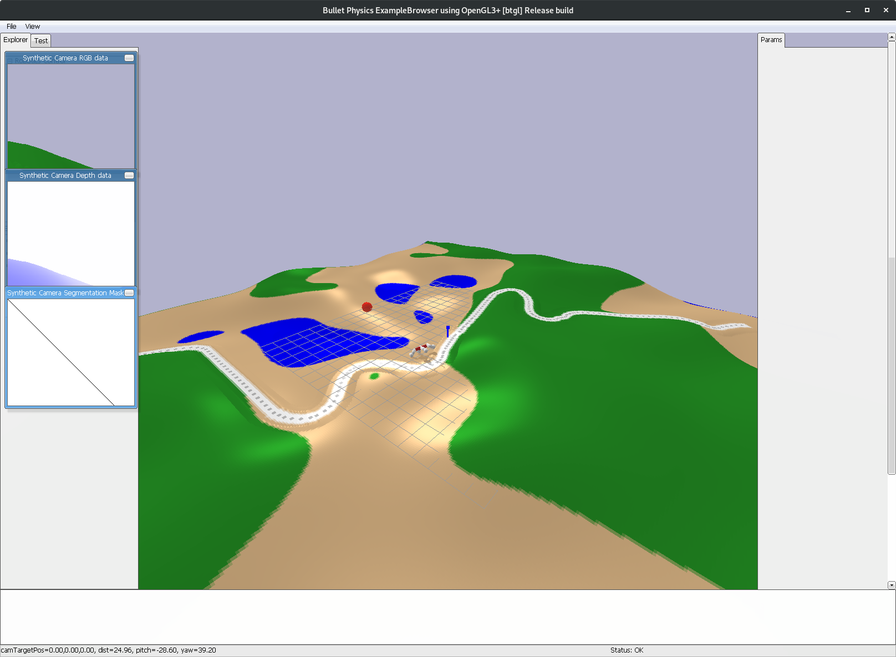
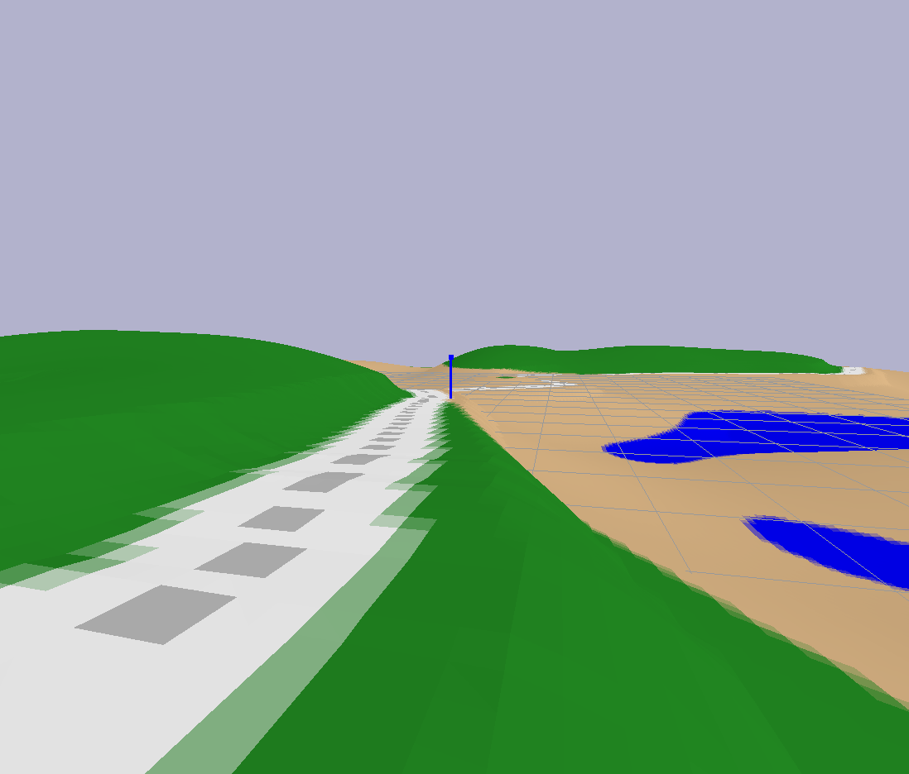
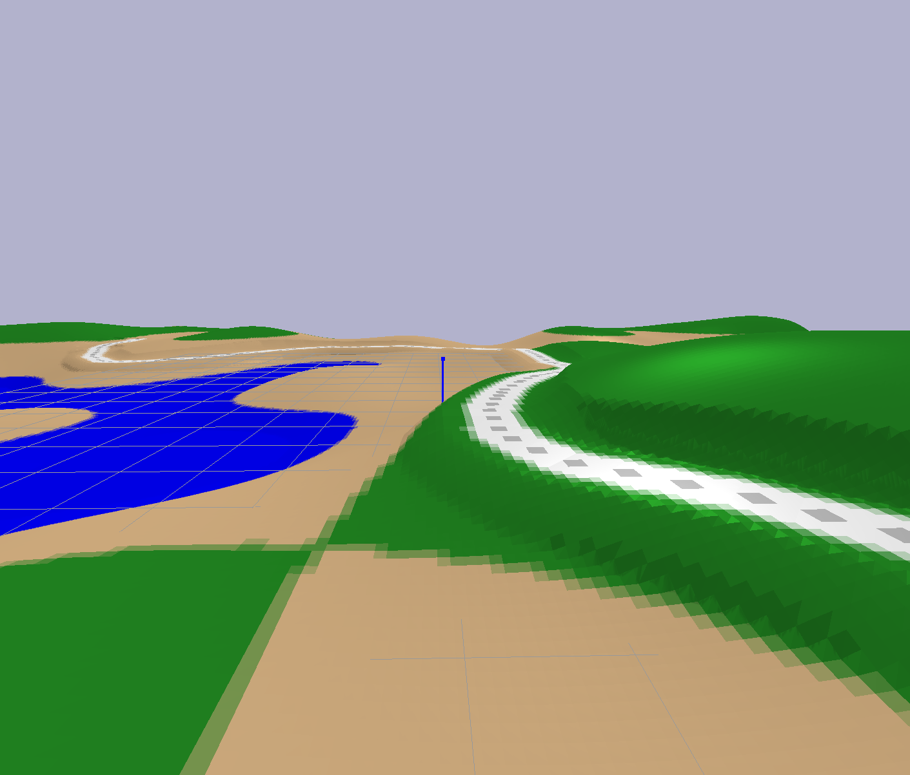
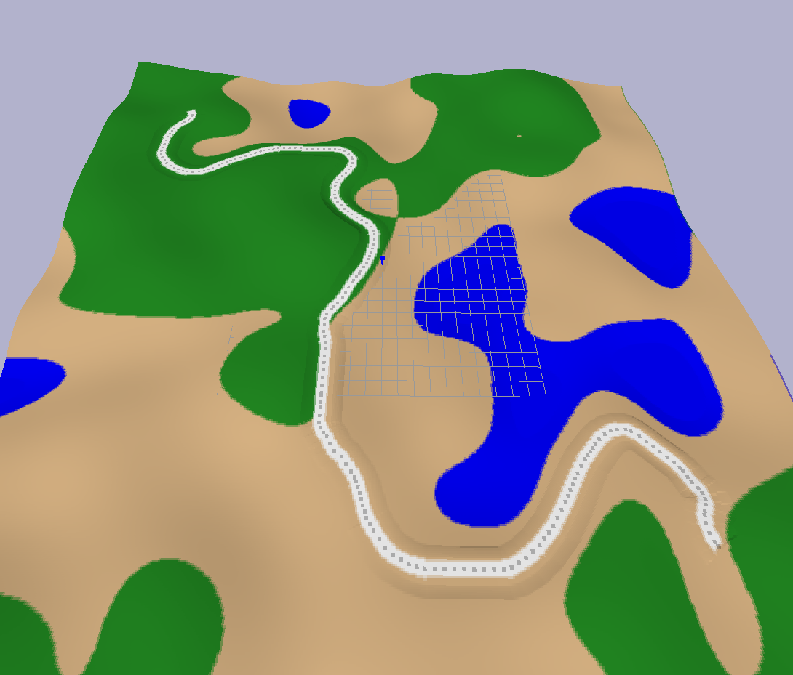
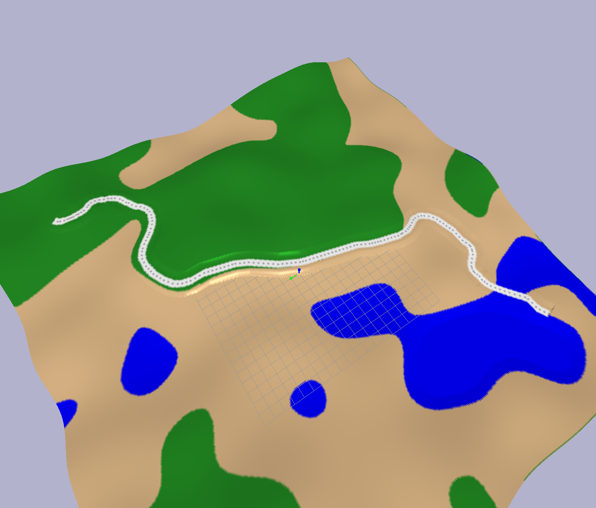
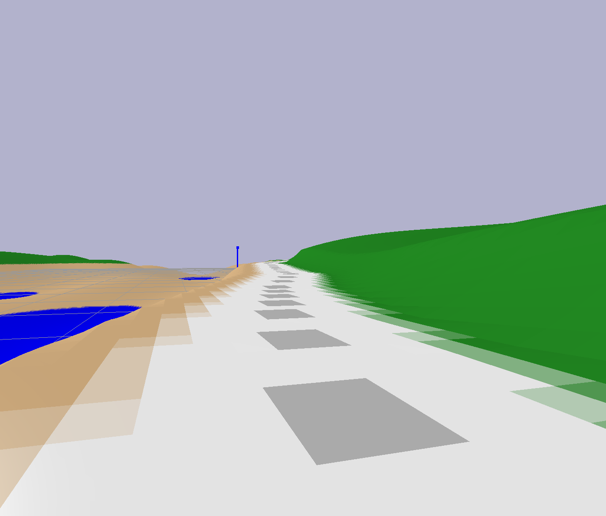

# rover_mesh
Files used to procedurally generate worlds for Rover's vision system.

Run "python3 generate_mesh.py" to generate and view a world.

Run "python3 run_rimulation.py" to run a simulation with a simulated robot
driving forward through the world.

This software uses the Pybullet simulator. Long term, the goal is to build a
reinforcement learning agent that can follow any randomly generated trail
from beginning to end.

Dec 2018 status:
I've begun moving some of the code from "prototype" code to something more
organized. Except "run_simulation.py", which is a mess.

# Screenshots

